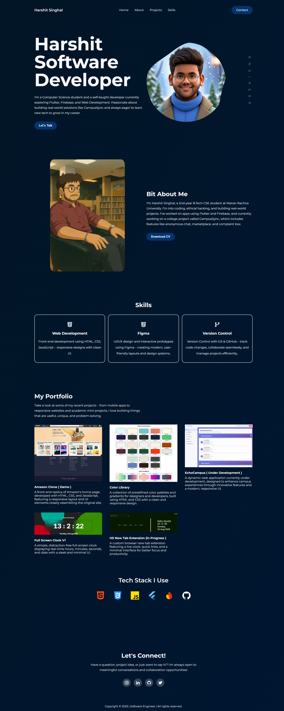

🌐 Personal Portfolio

A personal portfolio website to showcase my projects, skills, and achievements.  
Built with **HTML**, **CSS**, and **JavaScript**, and deployed on **Vercel**.

## 🚀 Features
- Modern, responsive design
- Project showcase with live previews
- Hover effects and animations
- Tech stack highlights
- Mobile-friendly layout

## 📂 Folder Structure
portfolio/
 
│── assets/ # Images, icons, and other static files
 
│── css/ # Stylesheets
 
│── js/ # JavaScript files
 
│── index.html # Main HTML file
 
│── README.md # Project documentation

## 🛠️ Tech Stack
- **HTML5**
- **CSS3**
- **JavaScript**
- **Vercel** (deployment)

## 📸 Preview

## 🔗 Live Demo
[View Portfolio](https://your-vercel-link.com)

## 📜 License
This project is licensed under the MIT License.

💡 _Feel free to fork this repository and customize it to create your own portfolio._
